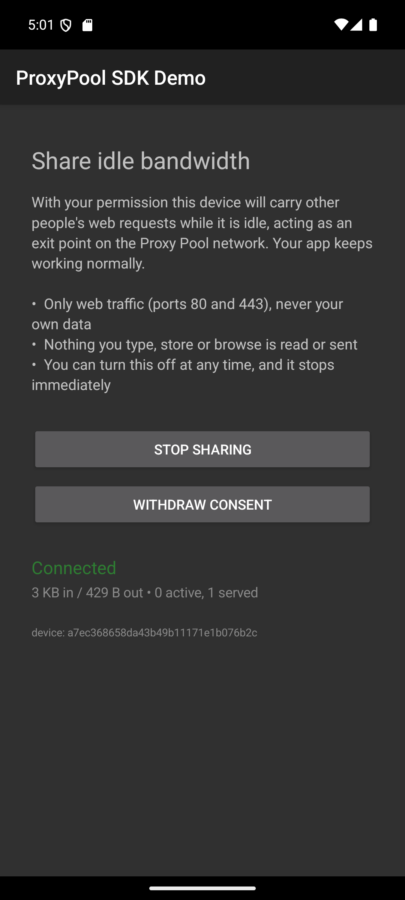

<p align="center">
  
</p>

<h1 align="center">Proxy Pool SDK for Android</h1>

<p align="center">
  <b>Turn your app's idle bandwidth into revenue — with your users' explicit consent.</b><br>
  Your users' devices become residential proxy exit nodes. You get paid per active
  device, per day.
</p>

<p align="center">
  <a href="https://sdk.ipsterr.com"><b>Apply for a partner key →</b></a> &nbsp;·&nbsp;
  <a href="docs/protocol.md">Protocol</a> &nbsp;·&nbsp;
  <a href="docs/disclosure.md">Disclosure guide</a> &nbsp;·&nbsp;
  <a href="CONTRIBUTING.md">Contributing</a>
</p>

<p align="center">
  
  
  
  
</p>

---

## How you make money with it

You already have users. Their phones and TV boxes spend most of the day online
and idle. This SDK lets the ones who **agree** contribute that idle bandwidth to
the ipsterr residential proxy network — and you are paid for it.

```
your app  ──SDK──▶  coordinator  ──▶  proxy pool  ──▶  our customers
   │                                                        │
   └──────────── you get paid per active device/day ◀────────┘
```

**The payout model is per active device, per day** — not per GB. That is
deliberate: it is predictable for you, it does not swing with how much a
customer happened to pull that day, and it is the model developers in this
market already understand.

| What you bring | What it is worth |
|---|---|
| A device in the US / UK / DE | The top of the rate card |
| A device on **mobile data** | A premium uplift — cellular IPs are the scarcest tier |
| An **Android TV box / signage player** | The best inventory there is: always on, stable residential IP, nothing competing for the uplink |
| A device with no resolvable country | Nothing. It is not sellable inventory, and the dashboard tells you so |

Rates are geo-weighted and published live — your dashboard reads them from
`GET /v1/rates`, so what you see is what you are paid. Payouts in **crypto
(USDT)** or **PayPal**, minimum $10.

A day only counts once a device has actually served customer traffic. **You are
paid on bytes we relayed, never on uptime a device claims** — which is also why
you cannot be undercut by someone farming fake devices into the same pool.

> **Not a fit for every app.** If your users are on metered data all day, or your
> app is already a battery hog, this will cost you more in uninstalls than it
> pays. It shines in apps that sit idle on Wi-Fi: media players, launchers,
> utilities, digital signage, TV boxes.

## Get started

1. **[Apply at sdk.ipsterr.com](https://sdk.ipsterr.com)** — tell us your
   app and, most importantly, **how you will tell your users**. A human reads
   that. It is the difference between an approval and a decline.
2. You get a partner key by email.
3. Drop the SDK in, ship your consent screen, and watch the dashboard.

```kotlin
// Application.onCreate
ProxyPoolSdk.init(this, SdkConfig(
    apiKey = BuildConfig.PROXYPOOL_KEY,
    coordinatorUrl = "wss://node.ipsterr.com",
))

// ...only after the user has read a disclosure and pressed an affirmative button:
ProxyPoolSdk.setConsent(context, true)
ProxyPoolSdk.start(context)
```

That is the whole integration. One dependency (OkHttp), a 45 KB AAR, minSdk 24.

---

## The one rule

**Nothing runs without explicit, informed consent, and withdrawing it stops the
tunnel immediately.**

This is not boilerplate. Every bandwidth network that has ended up in court
ended up there over *disclosure*, not over the technology. Before you call
`setConsent(context, true)`, your user must have been told, in plain language:

- their internet connection will carry other people's web traffic while idle,
- what they get in return,
- and how to turn it off.

The SDK enforces its half: it refuses to connect without consent, the
coordinator refuses a device whose handshake does not assert it, a persistent
notification is shown the whole time it is sharing, and tapping that
notification opens your app so the off switch is always one tap away.

[`docs/disclosure.md`](docs/disclosure.md) has copy you can adapt and the four
things that must be true. [`app/`](app/) is a working reference screen — this is
it, running:

<p align="center">
  
</p>

**Read one of them before you write your own.**

## What it does not do

| | |
|---|---|
| Read your users' traffic | No. It relays bytes for connections the coordinator opens; it has no access to the host app's data, and TLS is opaque to it. |
| Collect identifiers | No IMEI, ANDROID_ID or advertising id. A random per-install id, forgotten when consent is withdrawn. |
| Reach the user's home network | Refused. A destination that resolves to a private, loopback or link-local address is rejected *after* resolution, on the device. |
| Open arbitrary ports | Web ports only by default (80/443/8080/8443). A residential exit that can reach port 25 is an open spam relay. |
| Run behind the user's back | Foreground service, permanent notification, stops within seconds of consent being withdrawn. |
| Drain a phone | Wi-Fi only, screen off, battery floor — all on by default, all re-evaluated continuously. |

## Install

```bash
./gradlew :sdk:assembleRelease       # -> sdk/build/outputs/aar/sdk-release.aar
```

```kotlin
dependencies {
    implementation(files("libs/sdk-release.aar"))
    implementation("com.squareup.okhttp3:okhttp:4.12.0")
}
```

Maven Central publication is coming; until then the AAR is built from this repo.
Requirements: **minSdk 24**, JDK 17+, AGP 8.7+.

### Watch what it is doing

```kotlin
ProxyPoolSdk.onState = { state ->
    statusLabel.text = when (state.status) {
        SdkState.Status.CONNECTED -> "Sharing — ${state.bytesDown / 1_000_000} MB"
        SdkState.Status.WAITING   -> state.detail      // "Paused on mobile data"
        else                      -> "Not sharing"
    }
}
```

Always delivered on the main thread.

### Configuration

| Option | Default | Notes |
|---|---|---|
| `apiKey` | required | Your partner key; decides who gets paid. |
| `coordinatorUrl` | `ws://10.0.2.2:8765` | The emulator's view of your dev machine. Production is always `wss://`. |
| `wifiOnly` | `true` | Off means you are spending the user's mobile data. Cellular earns the premium rate — but only tell users the truth about it. |
| `requireCharging` | `false` | |
| `minBatteryPercent` | `20` | `0` disables. |
| `onlyWhenScreenOff` | `true` | "Idle bandwidth" is the promise; competing with the app the user is looking at is not idle. |
| `maxStreams` | `8` | Concurrent customer connections. |
| `debugLogging` | `false` | |

Conditions are re-evaluated continuously. A user who walks off Wi-Fi mid-transfer
stops sharing within seconds, and the notification says why.

### Android TV and TV boxes — where the money is

Always on, mains powered, stable residential IP, nothing competing for the
uplink. There is a preset:

```kotlin
ProxyPoolSdk.init(this, SdkConfig.forAndroidBox(apiKey, coordinatorUrl))
```

It drops the battery and screen rules, raises `maxStreams` to 24, and the
service takes a partial wake lock so a relay is not cut short by CPU sleep. The
bundled `BootReceiver` brings sharing back after a power cut — which is how you
keep those nodes through a 4 a.m. outage.

For a TV app, also declare (the demo app does):

```xml
<uses-feature android:name="android.hardware.touchscreen" android:required="false" />
<uses-feature android:name="android.software.leanback"    android:required="false" />
```

## Try it end to end, locally

No partner key needed to see it work — run your own coordinator:

```bash
# terminal one — the coordinator (prints the secrets it generates)
python -m coordinator

# terminal two
./gradlew :app:installDebug          # then tap "I agree — start sharing"

# terminal three — a real request, exiting through your device
curl -x "socks5h://demo:<customer secret>@127.0.0.1:1080" https://api.ipify.org
```

`ws://10.0.2.2:8765` — the SDK's default — is the host machine as seen from the
Android emulator, so the demo app works with no configuration at all.

## Porting to other platforms

The device side is one WebSocket, five opcodes, and nothing Android-specific.
[`docs/protocol.md`](docs/protocol.md) is the complete specification.

Anything that can open a WebSocket and a TCP socket can be a node — **LG webOS**
and **Samsung Tizen** TV apps included (both are JavaScript sandboxes where
WebSocket is the only transport available, which is exactly why the protocol is
built on it). Desktop and routers too.

**Ports are the most useful thing anyone can contribute.** See
[CONTRIBUTING.md](CONTRIBUTING.md).

## Repository layout

```
sdk/   the library
  ProxyPoolSdk      public API: init, consent, start/stop, state
  SdkConfig         sharing rules (network, battery, screen, concurrency)
  TunnelService     foreground service; owns the policy
  TunnelClient      the WebSocket tunnel; owns the socket
  NetworkGate       continuously decides whether sharing is allowed
  Identity          server-issued device identity
  BootReceiver      resume after a reboot, if consent was already given
app/   reference integration: a disclosure screen and a live status readout
docs/  protocol specification, disclosure guide
```

## Contributing

Issues and pull requests are welcome — [CONTRIBUTING.md](CONTRIBUTING.md). The
one hard rule: **never weaken a consent or safety check to make something work.**
If a check is in the way, open an issue and say so; it may well be wrong, but it
gets changed deliberately.

Security issues: [SECURITY.md](SECURITY.md), not a public issue.

## Who is behind it

Built by the team behind **[ipsterr](https://ipsterr.com)** — residential, mobile and datacenter proxies,
crypto-friendly, no KYC. This SDK is how the network sources its residential IPs:
directly from consenting users, paid for openly, instead of buying them
wholesale from someone who will not say where they came from.

## License

[MIT](LICENSE).

---

<sub>Keywords, so the people looking for this can find it: android sdk to monetize
app · passive income sdk · earn money from your app's idle bandwidth · bandwidth
sharing sdk · residential proxy sdk · make money online with an android app ·
proxy exit node sdk · android tv box monetization · pay per DAU sdk · alternative
to ads.</sub>
